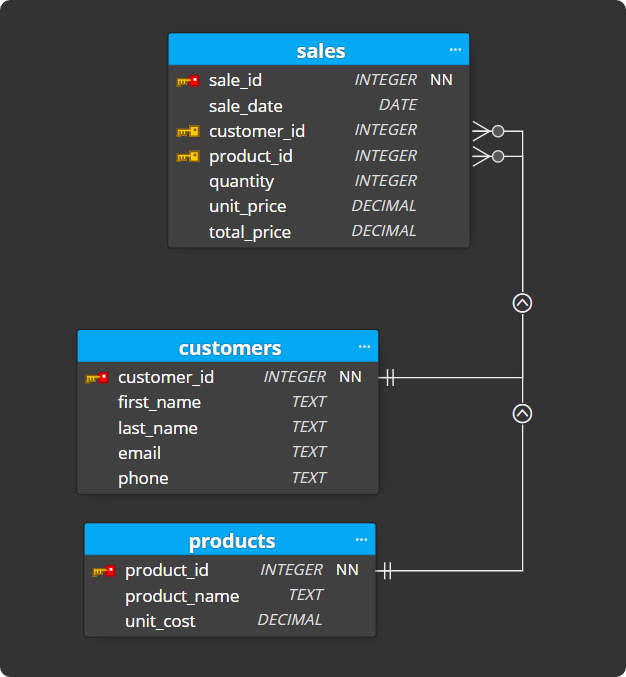
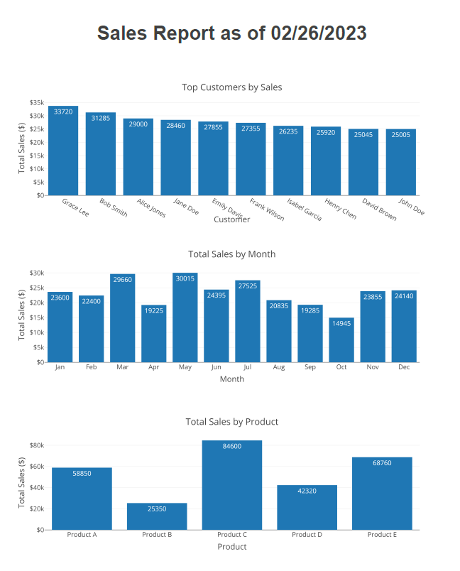

<h1 align="center">
 Report Generator
</h1>

## 📜 Description:

- Designed and developed a dynamic report generator utilizing SQL queries and Python.
- Utilized SQL queries to extract and aggregate data from relational databases and python scripting to preprocess and transform retrieved data

## 🛠 TechStack/framework used:

- Python.
- Pandas.
- SQL.

## Database Schema

## PDF Output Example

## References

- Python https://youtu.be/rfscVS0vtbw?si=swaG8O9VfIndgWBe
- Pandas https://youtu.be/r-uOLxNrNk8?si=kX1DTZqqBFoqvIcQ
- SQL https://youtu.be/7S_tz1z_5bA?si=gwn6Qzo4lvYUvC4K
